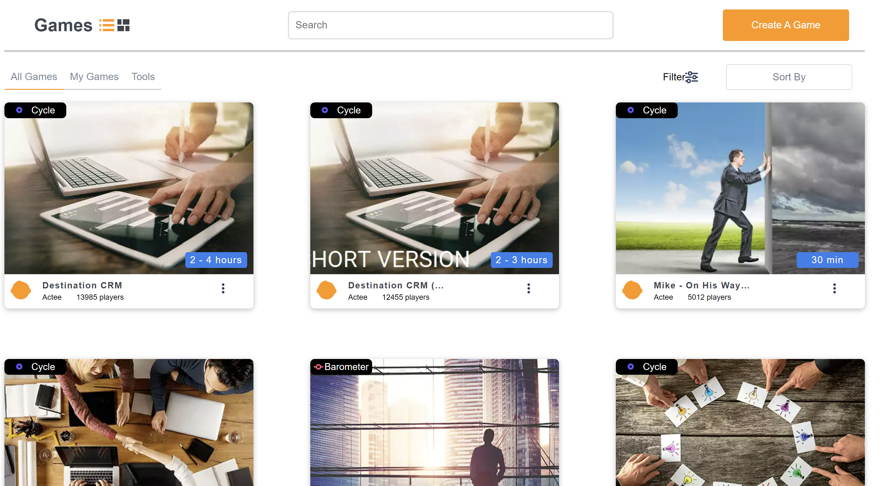

# Actee
A task by Actee Team

# Implementation
    Created a webpage
        pages folder    :   
                            Games Module
        shared folder   :   
                            components: Games Component
                            uicomponents: modal component
                            constants: game constants used in the application

        shared folder: can have all the shared folders that can be shared accross different parts of the application

# Angular concepts used
    Lazy loading for Games Feature Module
    Async pipe
    Search pipe: Once we have the backend we can create a better search
    Modal created with the service and used the change detection
    Service created to fetch the games like from the backend for now just added the json data

# Modification can be done
    Given the time there are limited things that can be done, since I have taken nearly 6 hours to complete this task
    I could do limited links in that time

    > Points to add up or improve
        on scroll loading of the game image tiles rather loading on first go
        Having a theme css file for all the common css to write
        Testcase can be written for all the components and service created 
        Using saas way of writting the css
        Images can be stored in the data base in binary foramt and can be fetched in frontend and rendered
        use typescript effeciently by adding the interface for games json response a
        Media Queries for the site

# Project Link video

    Video shows the successfull build of the Application: https://youtu.be/wTLkjFUD3hw
    Video shows functionality of the Application: https://www.youtube.com/watch?v=zKF6I_Trxdg